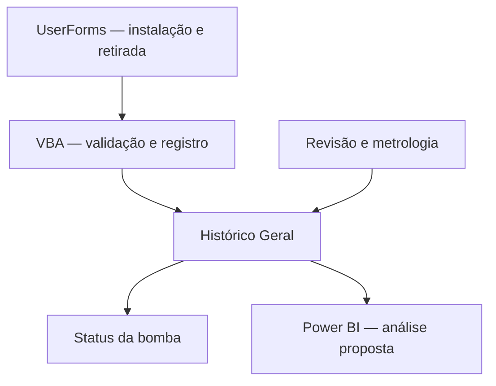

# Rastreabilidade digital de Bombas de Título

Projeto de engenharia e dados que utiliza **Excel, VBA e UserForms** para registrar o ciclo de instalação, retirada e revisão de bombas industriais. A solução organiza as movimentações por ID, atualiza o estado de cada equipamento e estrutura uma base para análises de manutenção.

**Autor:** Eduardo Corrêa Gouvêa  
**Tecnologias:** Excel, VBA e UserForms; Power BI como camada analítica proposta.

📄 [Leia o relatório técnico completo](Projeto_Rastreabilidade_Bombas_Titulo.pdf)

## O problema

O controle das Bombas de Título dependia de cartões físicos presos aos equipamentos. O contato com óleo, calor, colódio e atrito comprometia a legibilidade desses registros. Campos incompletos e cartões danificados dificultavam a identificação da última instalação, do motivo da retirada e do tempo de operação.

O desafio era organizar a informação desde o registro da movimentação, permitindo relacionar os eventos de um mesmo equipamento e apoiar decisões de manutenção.

## Diagnóstico apresentado no relatório

| Indicador histórico | Resultado |
| --- | --- |
| Registros analisados | 1.782 |
| Registros marcados como cartão não preenchido corretamente | 1.047 — 58,8% da base |
| Retiradas com inconsistência | 821 de 895 — 91,7% |

Esses números descrevem o diagnóstico inicial documentado no PDF. **Não representam uma redução de falhas ou um ganho de produtividade medido após a implantação.** A base bruta não acompanha esta apresentação.

## Solução desenvolvida

O Excel funciona como interface operacional, com formulários que orientam o preenchimento e rotinas VBA que validam e registram as movimentações.

| Funcionalidade | Aplicação |
| --- | --- |
| Identificação por ID | Relaciona os registros ao mesmo equipamento |
| Instalação | Registra turno, máquina e posição, com regras de coerência |
| Retirada com histórico | Recupera a instalação anterior e registra o motivo da retirada |
| Retirada sem histórico | Trata equipamentos sem registro digital completo do período anterior |
| Histórico Geral | Acrescenta um evento para cada movimentação |
| Dias de operação | Calcula o intervalo entre instalação e retirada quando há histórico válido |
| Status da BT | Consolida a situação mais recente de cada bomba |
| Metrologia | Compara medições com tolerâncias técnicas e registra aprovação ou falha |
| Proteção das abas | Reduz alterações manuais acidentais na base |

## Organização do fluxo

O histórico mantém os eventos, enquanto o status oferece uma visão da condição atual. A metrologia registra o resultado técnico da revisão, diferenciando equipamentos disponíveis para instalação daqueles com falha na avaliação.

## Minha contribuição

- Mapeamento do processo de movimentação e manutenção das bombas.
- Análise da qualidade dos registros históricos e identificação dos principais campos ausentes.
- Desenvolvimento e organização das rotinas VBA de instalação, retirada, histórico, status e metrologia.
- Definição de validações para reduzir inconsistências no preenchimento.
- Proposição de indicadores gerenciais e uso da base no Power BI.
- Documentação técnica das funcionalidades, limitações e implantação gradual.

## Análises propostas no Power BI

A base estruturada pode alimentar indicadores de disponibilidade, dias médios de operação, frequência de retiradas, motivos de falha e resultados de metrologia. Também permite investigar equipamentos com retorno prematuro e posições com maior concentração de ocorrências.

O Power BI é apresentado como uma camada de leitura e análise. **Esta documentação não comprova a implantação de um painel em produção e não inclui arquivo `.pbix`.**

## Conteúdo deste repositório

| Arquivo | Conteúdo |
| --- | --- |
| `README.md` | Visão geral, funcionalidades e limites do projeto |
| `Projeto_Rastreabilidade_Bombas_Titulo.pdf` | Relatório técnico com diagnóstico, diagramas, estrutura do sistema e trechos VBA explicados |

O PDF descreve módulos e formulários, mas seus trechos de código são explicativos e dependem de outras rotinas e da estrutura da planilha. **Estes dois arquivos não constituem um sistema completo pronto para executar.**

Para conhecer o projeto, comece pelo resumo e diagnóstico no PDF; em seguida, consulte a estrutura do sistema e a seção de códigos comentados. Não há necessidade de executar macros para consultar a documentação.

## Limitações e próximos passos

- Uso simultâneo e escala exigem atenção em uma solução baseada em Excel/VBA.
- A qualidade do histórico depende do registro das movimentações no momento adequado.
- Tolerâncias de metrologia e regras de operação precisam de validação pela equipe técnica.
- Proteção de planilhas reduz alterações acidentais, mas não substitui controles de acesso, backup ou gestão de versões.
- A evolução pode incluir armazenamento em banco de dados e acompanhamento dos indicadores de qualidade após a implantação.

## Escopo do material

Este repositório apresenta o projeto de rastreabilidade de Bombas de Título, distinto do projeto de registros de serviços emergenciais com Power Automate.

O relatório apresenta trechos com nomes e configurações generalizados para portfólio. Não são distribuídas bases brutas nem uma cópia executável do ambiente corporativo. A inclusão de novos materiais internos deve respeitar as autorizações aplicáveis.
